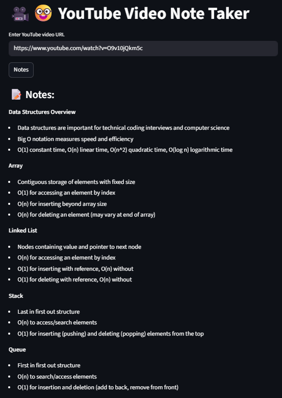

# 🎥 YouTube Video Notetaker (with Smart Timestamps)

An AI-powered Python + Streamlit app that transforms any YouTube video into a set of **clean, structured notes** — with **timestamps only where it matters**.

---

## What It Does

- Extracts notes from YouTube video transcripts using GPT
- Adds timestamps **only for important moments** (e.g., examples, quotes, key insights)
- Simple UI to paste a YouTube URL and generate notes instantly
- Great for lectures, podcasts, tutorials, and talks

---

## Requirements

Install everything you need with:

```bash
pip install -r requirements.txt
```

## Example
